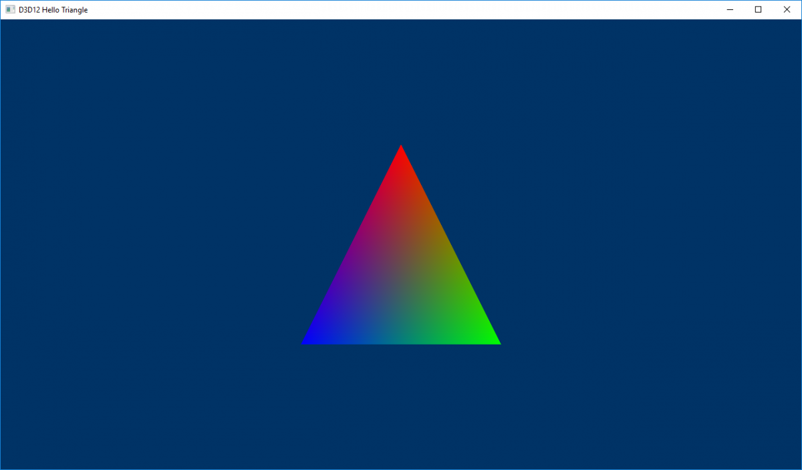
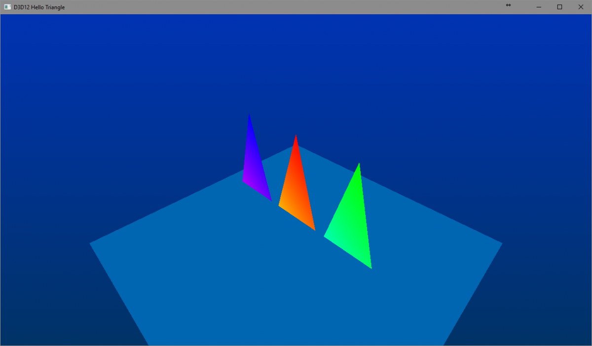
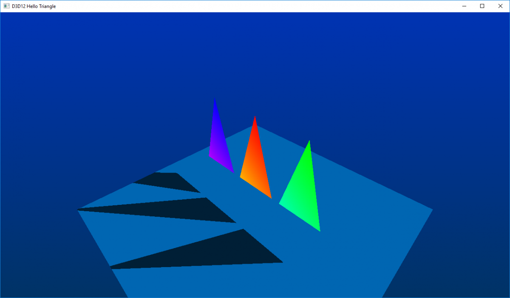

[TOC]

# DirectX 12光线追踪教程番外篇：另一种射线类型

译者：林公子

## 1 DXR教程番外篇：另一种射线类型
***

欢迎来到本教程的下一节。如果你错过了第一节教程，它在[这里](https://developer.nvidia.com/rtx/raytracing/dxr/DX12-Raytracing-tutorial-Part-1)。本教程的基础从上一个教程的结尾开始。你可以在[这里]((https://developer.nvidia.com/rtx/raytracing/dxr/tutorial/Files/dxr_tutorial.zip))下载整个项目。 第一个教程只展示了一个带有简单着色器的三角形。



DXR允许使用几种射线类型，通常用于渲染不同的效果，如主射线（我们在之前的教程中一直在做）和阴影射线。在开始本教程之前，我们首先需要添加一些几何体来投射阴影，以及一个透视摄像机。一旦完成，图像应该是这样的。



我们首先需要声明用于阴影着色器的新着色器库，以及它在头文件末尾的根签名。

```c++
// #DXR Extra - Another ray type
ComPtr<idxcblob> m_shadowLibrary;
ComPtr<id3d12rootsignature> m_shadowSignature;
```

### 1.1 ShadowRay.hlsl
***

创建一个`ShadowRay.hlsl`文件，将其添加到项目中，并将其排除在构建之外，以避免在构建期间调用`fxc`。这个文件将包含追踪阴影射线时执行的着色器代码。

```hlsl
// #DXR Extra - Another ray type
// Ray payload for the shadow rays
struct ShadowHitInfo
{
    bool isHit;
};

struct Attributes
{	
    float2 uv;
};

[shader("closesthit")]
void ShadowClosestHit(inout ShadowHitInfo hit, Attributes attributes)
{
    hit.isHit = true;
}

[shader("miss")]
void ShadowMiss(inout ShadowHitInfo hit : SV_RayPayload)
{
    hit.isHit = false;
}
```

这种射线类型有自己的payload, ShadowHitInfo。当击中一个表面时，payload被设置为`true`，而当错过所有几何体时，`ShadowMiss`被调用，payload被设置为false。

### 1.2 Hit.hlsl
***

`Hit`着色器需要能够投射阴影射线，所以我们首先在文件的开头声明阴影射线的payload。

```hlsl
// #DXR Extra - Another ray type
struct ShadowHitInfo
{
    bool isHit;
};
```

为了投射更多的射线，平面的`Hit`着色器需要访问顶层加速结构。

```hlsl
// #DXR Extra - Another ray type
// Raytracing acceleration structure, accessed as a SRV
RaytracingAccelerationStructure SceneBVH : register(t2);
```

然后，`PlaneClosestHit`函数可以被修改来发射阴影射线。从命中点出发，我们初始化一条阴影射线，射向硬编码的光照位置`lightPos`。追踪调用后的payload表明是否有一个表面被击中，我们用它来修改输出的颜色。

```hlsl
// #DXR Extra - Another ray type
[shader("closesthit")] 
void ClosestHit(inout HitInfo payload, Attributes attrib) 
{ 
    float3 barycentrics = float3(1.f - attrib.bary.x - attrib.bary.y, attrib.bary.x, attrib.bary.y); 
    
    uint vertId = 3 * PrimitiveIndex(); 
    
    // #DXR Extra: Per-Instance Data 
    float3 hitColor = float3(0.6, 0.7, 0.6); 
    
    // Shade only the first 3 instances (triangles) 
    if (InstanceID() < 3) 
    { 
        // #DXR Extra: Per-Instance Data
        hitColor = BTriVertex[indices[vertId + 0]].color * barycentrics.x + 
                   BTriVertex[indices[vertId + 1]].color * barycentrics.y + 
                   BTriVertex[indices[vertId + 2]].color * barycentrics.z; } 
                   
        payload.colorAndDistance = float4(hitColor, RayTCurrent());
    }
}
    
// #DXR Extra - Another ray type 
[shader("closesthit")] 
void PlaneClosestHit(inout HitInfo payload, Attributes attrib) 
{ 
    float3 lightPos = float3(2, 2, -2); 
    
    // Find the world - space hit position 
    float3 worldOrigin = WorldRayOrigin() + RayTCurrent() * WorldRayDirection(); 
    
    float3 lightDir = normalize(lightPos - worldOrigin); 
    
    // Fire a shadow ray. The direction is hard-coded here, but can be fetched
    // from a constant-buffer 
    RayDesc ray; 
    ray.Origin = worldOrigin; 
    ray.Direction = lightDir; 
    ray.TMin = 0.01; 
    ray.TMax = 100000; 
    bool hit = true; 
    
    // Initialize the ray payload 
    ShadowHitInfo shadowPayload; 
    shadowPayload.isHit = false; 
    
    // Trace the ray 
    TraceRay( 
        // Acceleration structure 
        SceneBVH, 
        // Flags can be used to specify the behavior upon hitting a surface 
        RAY_FLAG_NONE, 
        // Instance inclusion mask, which can be used to mask out some geometry to 
        // this ray by and-ing the mask with a geometry mask. The 0xFF flag then 
        // indicates no geometry will be masked
        0xFF, 
        // Depending on the type of ray, a given object can have several hit 
        // groups attached (ie. what to do when hitting to compute regular 
        // shading, and what to do when hitting to compute shadows). Those hit 
        // groups are specified sequentially in the SBT, so the value below 
        // indicates which offset (on 4 bits) to apply to the hit groups for this 
        // ray. In this sample we only have one hit group per object, hence an 
        // offset of 0. 
        1, 
        // The offsets in the SBT can be computed from the object ID, its instance 
        // ID, but also simply by the order the objects have been pushed in the 
        // acceleration structure. This allows the application to group shaders in 
        // the SBT in the same order as they are added in the AS, in which case 
        // the value below represents the stride (4 bits representing the number 
        // of hit groups) between two consecutive objects. 
        0, 
        // Index of the miss shader to use in case several consecutive miss 
        // shaders are present in the SBT. This allows to change the behavior of 
        // the program when no geometry have been hit, for example one to return a 
        // sky color for regular rendering, and another returning a full 
        // visibility value for shadow rays. This sample has only one miss shader, 
        // hence an index 0 
        1, 
        // Ray information to trace ray, 
        // Payload associated to the ray, which will be used to communicate 
        // between the hit/miss shaders and the raygen 
        shadowPayload); 
        
        float factor = shadowPayload.isHit ? 0.3 : 1.0; 
        float3 barycentrics = float3(1.f - attrib.bary.x - attrib.bary.y, attrib.bary.x, attrib.bary.y); 
        
        float4 hitColor = float4(float3(0.7, 0.7, 0.3) * factor, RayTCurrent()); 
        
        payload.colorAndDistance = float4(hitColor);
}
```

### 1.3 CreateHitSignature
***

由于`Hit`着色器现在需要访问场景数据，它的根签名需要被增强，以获得对包含顶层加速结构的SRV的访问，该结构被存储在堆的第二个槽中。在添加根参数后添加这段代码。

```c++
// #DXR Extra - Another ray type
// Add a single range pointing to the TLAS in the heap
rsc.AddHeapRangesParameter({ { 2 /*t2*/, 1, 0, D3D12_DESCRIPTOR_RANGE_TYPE_SRV, 1 /*2nd slot of the heap*/ },
});
```
### 1.4 CreateRaytracingPipeline
***
我们现在需要加载着色器库并导出相应的符号。

```c++
// #DXR Extra - Another ray type
// Hit group for all geometry when hit by a shadow ray
pipeline.AddHitGroup(L"ShadowHitGroup", L"ShadowClosestHit");
```

然后，该命中组与它的根签名相关联。
```c++
// #DXR Extra - Another ray type
pipeline.AddRootSignatureAssociation(m_shadowSignature.Get(), { L"ShadowHitGroup" });
```

由于现在将有可能从命中点射出射线，这意味着射线被递归追踪。然后我们将允许的递归级别提高到2，记住这个级别需要尽可能的低。

### 1.5 CreateShaderBindingTable
***
光线追踪管线已经准备好发射阴影射线，但是实际的着色器仍然需要与着色器绑定表中的几何体相关联。为了做到这一点，我们在原来的`Miss`着色器之后添加阴影`Miss`着色器。

阴影命中组是在添加完原始命中组后立即添加的，这样所有的几何体都可以被命中。

```c++
// #DXR Extra - Another ray type
m_sbtHelper.AddHitGroup(L"ShadowHitGroup", {});
```

需要增加平面命中组的资源，以使其能够访问堆。

```c++
// #DXR Extra - Another ray type
m_sbtHelper.AddHitGroup(L"PlaneHitGroup", {(void*)(m_constantBuffers[0]->GetGPUVirtualAddress()), heapPointer});
```

### 1.6 CreateTopLevelAS
***
最后的补充是需要将几何体与相应的命中组联系起来。在之前的教程中，我们指出一个实例的命中组索引等于其实例索引，因为我们每个实例只有一个命中组。现在我们有两个命中组（主命中组和影子命中组），所以命中组索引必须是2*i，其中i是实例索引。

```c++
// #DXR Extra - Another ray type
for (size_t i = 0; i < instances.size(); i++)
{
    m_topLevelASWrapper.AddInstance(instances[i].first.Get(), instances[i].second, static_cast<uint>(i), static_cast<uint>(2 * i) /*2 hit groups per instance*/);
}
```

现在运行程序应该显示出投射在平面上的阴影。



这个例子介绍了如何使用几种射线类型，并应用于简单的阴影。一个更有效的阴影射线实现将只使用一个将payload设置为false的`Miss`着色器，而没有`Closest Hit `着色器，这个修改是留给读者的练习。