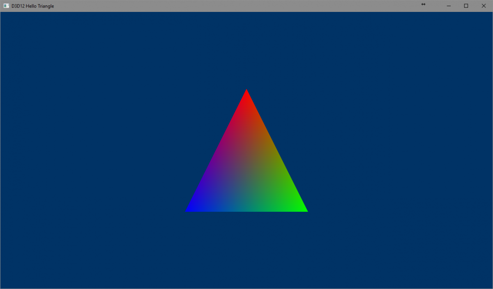
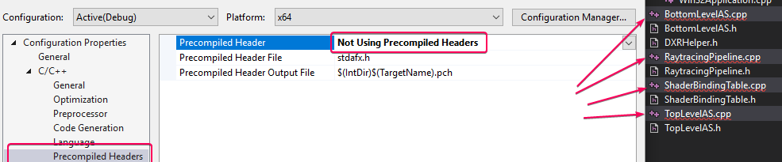
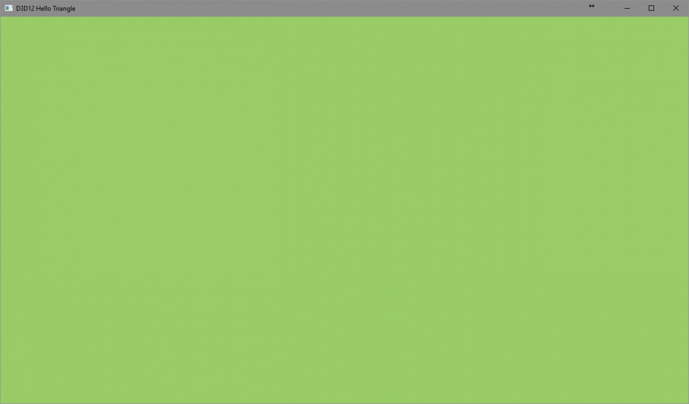
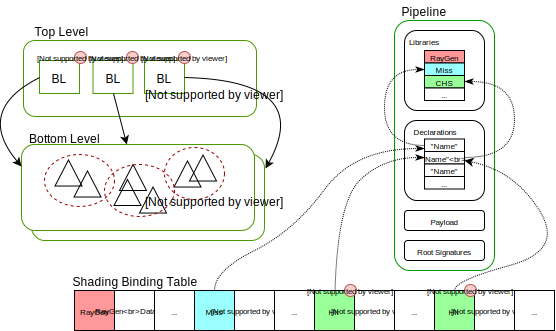

[TOC]

# DirectX 12光线追踪——第一部分

作者：[Martin-Karl Lefrançois](https://devblogs.nvidia.com/author/mlefrancois/) 和[Pascal Gautron](https://devblogs.nvidia.com/author/pgautron/)

译者：林公子

## 1 NVIDIA DXR示例
***
欢迎来到DirectX 12 DXR光线追踪教程的第一部分。这些文件和提供的代码的重点是展示在现有的DirectX 12示例中使用新的DXR API对光线追踪的基本整合。请注意，出于教育目的，所有的代码都包含在一组非常小的文件中。真正的整合将需要更多的抽象层次。

## 2 简介
***
最近DirectX 12 API中整合了光线追踪技术，称为DXR，让游戏开发者很兴奋。这篇文章以及所提供的代码展示了一个关于使用新的DXR API在现有的DirectX 12示例中整合光线追踪的基本教程。你将学习如何将光线追踪添加到现有的应用程序中，使光线追踪和光栅路径共享相同的几何体缓冲区。这是由两部分组成的教程的第一部分，涉及到Windows 10和DX12在光线追踪方面的初始设置。这两篇文章展示了在现有的DirectX示例中对光线追踪的基本整合。

### 2.1 教程的目标
***
本教程的目的是在现有程序中加入光线追踪，使光线追踪和光栅路径共享相同的几何缓冲区。 我们将按部就班地了解做光线追踪所需的主要构件。你还将被邀请添加代码片段，逐步启用光线追踪器。添加光线追踪功能需要以下构建模块。

* 检测和启用光线跟踪功能
* 创建底层(Bottom Level)和顶层(Top Level)的加速结构（BLAS和TLAS），提供高性能的射线-几何求交能力。
* 创建和添加着色器：射线生成(Ray Generator)，命中(Hit)和未命中(Miss)描述了如何创建新的射线，以及在出现相交或未命中时该如何处理。
* 用各种着色器程序创建一个光线跟踪管线：Ray Generation, Hit和Miss。这是用来将光线追踪过程中使用的所有着色器打包在一起。
* 创建一个着色绑定表（Shader Binding Table, SBT），将几何图形与相应的着色器联系起来。

在 "附加 "中，我们将通过添加一些更多的元素来扩展最小程序。参见 "更进一步"部分。我们将添加按空格键在光栅化和光线追踪之间切换的功能。任何时候你都可以在引用部分获得更多关于DXR的参考资源链接。

## 3 Windows版本
***
**在进一步行动之前**：确保你运行的是Windows 10 1809或更高版本。


## 4 起点：Hello Triangle
***
在微软GitHub下有许多DirectX 12的示例，但对于本教程，你只需要HelloTriangle这个示例。

>HelloTriangle([下载](https://developer.nvidia.com/rtx/raytracing/dxr/tutorial/Files/HelloTriangle.zip))下载HelloTriangle Zip。

1.确保你安装了最新的Windows SDK。
2.打开解决方案，构建并运行。

>**如果遇到编译问题，请检查是否安装了最新的Windows SDK。右键点击解决方案，选择 "Retarget solution"到最新的SDK**。


<center><b>图1</b>：微软的HelloTriangle的结果</center>

## 5 DXR工具
***
在下面的教程中，我们将使用一些实用的函数来抽象出一些相当冗长的实现。这些抽象的实现，在[这里有](https://developer.nvidia.com/rtx/raytracing/dxr/DX12-Raytracing-tutorial/dxr_tutorial_helpers)完整的文档，应该有助于澄清DXR的概念。

>DXR Helpers（[下载](https://developer.nvidia.com/rtx/raytracing/dxr/tutorial/Files/DXRHelpers.zip)） 下载实用类，并复制到项目目录。

1.将实用程序文件添加到解决方案中。
2.选择所有的.cpp并将预编译标志设为**Not Using Precompiled Headers**。

3.添加$(ProjectDir)到项目的C/C++> General> Additional Include Directories中。
>在每个步骤之后，你应该能够运行示例，目前为止还没有渲染上的改变。

## 6 启用光线追踪功能

### 6.1 支持光线追踪的设备和命令列表
***
我们的示例使用了DirectX12最简单的API，在ID3D12Device和ID3D12GraphicsCommandList类中导出。光线追踪API要先进得多，也是最新的，被包含在ID3D12Device5和ID3D12GraphicsCommandList4类中。在D3D12HelloTriangle.h中，我们相应地替换了m_device和m_commandList的声明。

```c++
ComPtr<ID3D12Device5> m_device;
ComPtr<ID3D12GraphicsCommandList4> m_commandList;
```

在D3D12HelloTriangle.h中，我们添加了一个方法来检查设备是否支持光线追踪：
```c++
void CheckRaytracingSupport()。
```

该函数的主体被添加到D3D12HelloTriangle.cpp文件中。光线追踪功能是D3D12_FEATURE_DATA_D3D12_OPTIONS5功能集的一部分。
```c++
void D3D12HelloTriangle::CheckRayTracingSupport()
{
	D3D12_FEATURE_DATA_D3D12_OPTIONS5 options{};
	ThrowIfFailed(m_device->CheckFeatureSupport(D3D12_FEATURE_D3D12_OPTIONS5, &options, sizeof(options)));

	if (options.RaytracingTier < D3D12_RAYTRACING_TIER_1_0)
	{
		throw std::runtime_error("Ray Tracing not supported on device.");
	}
}
```
然后我们在**OnInit**的末尾添加对这个方法的调用。

我们还将增加通过按“空格键“在光栅化和光线跟踪之间切换的功能。
为了方便起见，我们在`D3D12HelloTriangle.h`中还引入了一个函数来在运行时切换光线跟踪和光栅化。
```c++
virtual void OnKeyUp(UINT8 key); 
bool m_raster = true;
```

### 6.2 OnInit()
***
在最初的`D3D12HelloTriangle`示例中，`LoadAssets`方法创建、初始化并关闭了命令列表。光线追踪的设置将需要一个开放的命令列表，为了清晰起见，我们倾向于在`OnInit`方法中添加初始化光线追踪的方法。因此，我们需要将以下几行代码从`LoadAssets()`中移出，放在`OnInit()`函数的最后。
```c++
// Command lists are created in the recording state, but there is
// nothing to record yet. The main loop expects it to be closed, so
// close it now.
ThrowIfFailed(m_commandList->Close());
```
### 6.3 LoadPipeline()
***
这不是必须的，但为了保持一致性，你可以将特性级别改为D3D_FEATURE_LEVEL_12_1。

### 6.4 PopulateCommandList()
***
找到清除缓冲区和发出绘图命令的代码块。

```c++
const float clearColor[] = { 0.0f, 0.2f, 0.4f, 1.0f };
m_commandList->IASetPrimitiveTopology(D3D_PRIMITIVE_TOPOLOGY_TRIANGLELIST);
m_commandList->ClearRenderTargetView(rtvHandle, clearColor, 0, nullptr);
m_commandList->IASetVertexBuffers(0, 1, &m_vertexBufferView);
m_commandList->DrawInstanced(3, 1, 0, 0);
```
并将其替换为以下内容，这样我们将只在光栅化模式下执行这个代码块。在光线追踪路径中，我们现在仅简单地用不同的颜色清除缓冲区。

```c++
// Record commands.
// #DXR
if (m_raster)
{ 
    const float clearColor[] = { 0.0f, 0.2f, 0.4f, 1.0f }; m_commandList->IASetPrimitiveTopology(D3D_PRIMITIVE_TOPOLOGY_TRIANGLELIST); m_commandList->ClearRenderTargetView(rtvHandle, clearColor, 0, nullptr); m_commandList->IASetVertexBuffers(0, 1, &m_vertexBufferView); m_commandList->DrawInstanced(3, 1, 0, 0);
}
else
{ 
    const float clearColor[] = { 0.6f, 0.8f, 0.4f, 1.0f }; m_commandList->ClearRenderTargetView(rtvHandle, clearColor, 0, nullptr);
}
```

### 6.5 OnKeyUp()
***
添加以下函数，用于在光栅化和光线跟踪模式之间切换。
```c++
//-----------------------------------------------------------------------------
//
//
void D3D12HelloTriangle::OnKeyUp(UINT8 key)
{ 
    // Alternate between rasterization and raytracing using the spacebar 
    if (key == VK_SPACE) 
    { 
        m_raster = !m_raster; 
    }
}
```

### 6.6 WindowProc()
***

下面的内容不是必须的，但它增加了按ESC键退出应用程序的便利性。在`Win32Application.cpp`文件的`WindowProc`函数中，在`WM_KEYDOWN`case分支添加以下代码来退出应用程序。
```c++
if (static_cast<uint8>(wParam) == VK_ESCAPE)
{
    PostQuitMessage(0);
}
```

### 6.7 Result
***

如果一切顺利的话，你应该能够编译、运行，并在按下空格键时，在光栅和光线跟踪模式之间进行切换。我们现在还没有做任何光线追踪，但这将是我们的起点。
|  Raster   | Compare          | Raytracing                          |
|:----:     |:----:            |:----:                               |
|   |↔|  |
<center><b>图2</b>：按空格键后</center>

## 7 系统概述
***

使用DXR的光线追踪需要3个主要的构建模块。加速结构存储几何信息以优化搜索射线交点，并分为底层加速结构（BLAS）和顶层加速结构（TLAS）。光线追踪管线包含了编译后的程序以及与每个着色器程序相关的函数名称，还有对这些着色器如何交换数据的描述。最后，着色器绑定表(SBT)将所有这些部分联系在一起，指出哪些着色器程序是为哪些几何体执行的，以及哪些资源与之相关。

为了方便与DXR的首次接触，我们之前添加的[辅助类](https://developer.nvidia.com/rtx/raytracing/dxr/DX12-Raytracing-tutorial/dxr_tutorial_helpers)直接映射到这些主要的构建模块。

<center></center>

<center><b>图3</b>：光线追踪构件的概述</center>

## 8 加速结构
***
为了提高效率，光线追踪需要把几何体放在一个加速结构（AS）中，这样可以减少渲染过程中的光线-三角求交测试次数。在DXR中，这个结构被分为两层树。 直观地说，这可以直接映射到场景图中的物体概念，图的内部节点已经塌陷(collapsed)成每个底层AS物体的单一变换矩阵。然后，这些BLAS持有每个对象的实际顶点数据。然而，也可以在一个单一的底层AS中组合多个对象：为此，可以从多个顶点缓冲器中建立一个BLAS，每个都有自己的变换矩阵。注意，如果一个对象在同一个BLAS中被多次实例化，它的几何数据将被复制。这对于提高静态的、非实例化的场景组件的性能特别有用（作为经验法则，BLAS越少越好）。对于每个BLAS，顶层AS将包含对象实例，每个实例都有自己的变换矩阵。我们将从一个包含三角形顶点的单一底层AS和一个顶层AS开始，用一个相同的变换来实例化它。

<center></center>
<center><b>图4</b>：加速结构</center>

`在D3D12HelloTriangle.h`中，添加这些内容来访问DirectX编译器的API、顶层加速结构[帮助类](https://developer.nvidia.com/rtx/raytracing/dxr/DX12-Raytracing-tutorial/dxr_tutorial_helpers)和标准库vector。

```c++
#include <dxcapi.h>#include <vector>
#include "nv_helpers_dx12/TopLevelASGenerator.h"
```
我们还需要在类定义的最后添加以下声明。首先，构建一个加速结构（AS）最多需要3个缓冲区：加速结构构建器内部使用的一些临时(scratch)内存，结构的实际存储，以及代表顶层加速结构实例矩阵的描述符。

```c++
// #DXR
struct AccelerationStructureBuffers
{ 
    ComPtr<id3d12resource> pScratch; // Scratch memory for AS builder
    ComPtr<id3d12resource> pResult;  // Where the AS is 
    ComPtr<id3d12resource> pInstanceDesc; // Hold the matrices of the instances
};
```

本教程将只使用一个底层的AS，对于它我们只存储`pResult`缓冲区。对于顶层AS，我们预计有可能实现动态变化，并保持对生成器辅助类和所有`AccelerationStructureBuffers`结构的跟踪。我们还预计到有几个实例的可能性，并存储一个`vector`，其条目将一个底层AS与一个转换矩阵联系起来。

```c++
ComPtr<id3d12resource> m_bottomLevelAS; // Storage for the bottom Level AS
nv_helpers_dx12::TopLevelASGenerator m_topLevelASGenerator;
AccelerationStructureBuffers m_topLevelASBuffers;
std::vector<std::pair<comptr<id3d12resource>, DirectX::XMMATRIX>> m_instances;
```

我们还引入了3个方法。
* `CreateBottomLevelAS`，从GPU内存中的顶点缓冲区`vector`和顶点数量生成底层AS。
* `CreateTopLevelAS`，从底层AS的`vector`和变换矩阵中生成顶层AS。
* `CreateAccelerationStructures`将上述方法结合在一起。

```c++
/// Create the acceleration structure of an instance
///
/// \param vVertexBuffers : pair of buffer and vertex count
/// \return AccelerationStructureBuffers for TLAS
AccelerationStructureBuffers
CreateBottomLevelAS(std::vector<std::pair<comptr<id3d12resource>, uint32_t>> vVertexBuffers);

/// Create the main acceleration structure that holds
/// all instances of the scene
/// \param instances : pair of BLAS and transform
void CreateTopLevelAS( const std::vector<std::pair<comptr<id3d12resource>, DirectX::XMMATRIX>>& instances);

/// Create all acceleration structures, bottom and top
void CreateAccelerationStructures();
```

在`D3D12HelloTriangle.cpp`中，我们将添加这些方法的实现。首先，包括以下内容来访问一些辅助函数和底层的AS辅助类。

```c++
#include "DXRHelper.h"
#include "nv_helpers_dx12/BottomLevelASGenerator.h"
```

### 8.1 CreateBottomLevelAS
***
为了创建底层加速结构（BLAS），我们要调用`CreateBottomLevelAS`并传递一个包含两个元素（std::pair）的数组。第一个元素是指向保存几何体顶点资源的指针，第二个元素是顶点的数量。注意，我们假设该资源包含`Vertex`结构体。 为了简单起见，我们不使用索引：三角形由三个`Vertex`描述。不过，辅助类是支持索引的，详情请见 "更进一步 "部分。函数`CreateBottomLevelAS`分为3个主要步骤。首先，它将所有的顶点缓冲区合并到BLAS构建器[辅助类](https://developer.nvidia.com/rtx/raytracing/dxr/DX12-Raytracing-tutorial/dxr_tutorial_helpers)中。BLAS的生成是在GPU上进行的，第二步是通过调用`ComputeASBufferSizes`来计算容纳最终BLAS以及一些临时空间的存储需求。这映射到实际的DXR API，它要求应用程序为BLAS以及临时（scratch）存储分配空间。构建完成后(即包含构建请求的命令列表执行完毕后)，这个临时空间就可以被释放出来。在内部，`ComputeASBufferSizes`方法调用`ID3D12Device5::GetRaytracingAccelerationStructurePrebuildInfo`，这将给出一个保守的内存需求估计。然后，这些缓冲区可以直接分配到GPU内存的默认堆上。 最后，可以通过调用`Generate`方法来生成BLAS。它将创建一个具有`D3D12_RAYTRACING_ACCELERATION_STRUCTURE_TYPE_BOTTOM_LEVEL`类型的加速结构构建工作的描述符，并使用该描述符调用`ID3D12GraphicsCommandList4::BuildRaytracingAccelerationStructure()`。由此产生的BLAS包含了几何体的全部定义，其组织方式适合于有效地寻找射线与该几何体的交点。

```c++
//-----------------------------------------------------------------------------
//
// Create a bottom-level acceleration structure based on a list of vertex
// buffers in GPU memory along with their vertex count. The build is then done
// in 3 steps: gathering the geometry, computing the sizes of the required
// buffers, and building the actual AS
//
D3D12HelloTriangle::AccelerationStructureBuffers D3D12HelloTriangle::CreateBottomLevelAS(const std::vector<std::pair<ComPtr<ID3D12Resource>, uint32_t>>& vertexBuffers)
{
    nv_helpers_dx12::BottomLevelASGenerator bottomLevelAS;

    // Adding all vertex buffers and not transforming their position. 
    for (const auto &buffer : vertexBuffers) 
    {
        bottomLevelAS.AddVertexBuffer(buffer.first.Get(), 
                                    0, 
                                    buffer.second, 
                                    sizeof(Vertex),
                                    0, 
                                    0);
    } 
    
    // The AS build requires some scratch space to store temporary information. 
    // The amount of scratch memory is dependent on the scene complexity.
    UINT64 scratchSizeInBytes = 0; 
    
    // The final AS also needs to be stored in addition to the existing vertex 
    // buffers. It size is also dependent on the scene complexity. 
    UINT64 resultSizeInBytes = 0; 
    bottomLevelAS.ComputeASBufferSizes(m_device.Get(), false, &scratchSizeInBytes, &resultSizeInBytes); 
    
    // Once the sizes are obtained, the application is responsible for allocating 
    // the necessary buffers. Since the entire generation will be done on the GPU, 
    // we can directly allocate those on the default heap 
    AccelerationStructureBuffers buffers; 
    buffers.scratch = nv_helpers_dx12::CreateBuffer( m_device.Get(), 
                                                    scratchSizeInBytes, 
                                              D3D12_RESOURCE_FLAG_ALLOW_UNORDERED_ACCESS, 
                                           D3D12_RESOURCE_STATE_COMMON,
                                                    nv_helpers_dx12::kDefaultHeapProps); 

    buffers.result = nv_helpers_dx12::CreateBuffer( m_device.Get(), 
                                                    resultSizeInBytes, 
                                              D3D12_RESOURCE_FLAG_ALLOW_UNORDERED_ACCESS, 
                                           D3D12_RESOURCE_STATE_RAYTRACING_ACCELERATION_STRUCTURE, 
                                                    nv_helpers_dx12::kDefaultHeapProps); 
    
    // Build the acceleration structure. Note that this call integrates a barrier
    // on the generated AS, so that it can be used to compute a top-level AS right 
    // after this method. 
    bottomLevelAS.Generate(m_commandList.Get(), 
               buffers.scratch.Get(), 
                buffers.result.Get(), 
                 false,
              nullptr);
    
    return buffers;
}
```

### 8.2 CreateTopLevelAS
***
顶层加速结构（TLAS）可以被看作是加速结构之上的加速结构，其目的是优化任何底层BLAS中的射线交点搜索。一个TLAS可以多次实例化同一个BLAS，使用每个实例的矩阵在不同的世界空间位置上渲染它们。在这个例子中，我们调用`CreateTopLevelAS`并传递一个由两个元素组成的数组（std::pair）。第一个元素是BLAS的资源指针，第二个元素是用来定位对象的矩阵。 在 "更进一步 "一节中，我们将使用这些矩阵为场景制作动画，只更新TLAS而保持BLAS不变，使其对刚体动画非常有用。这个方法在结构上与`CreateBottomLevelAS`非常相似，同样有3个步骤：收集输入数据，计算AS缓冲区大小，以及生成实际的TLAS。然而，TLAS需要一个额外的缓冲区来保存每个实例的描述。`ComputeASBufferSizes`方法通过调用I`D3D12Device5::GetRaytracingAccelerationStructurePrebuildInfo`来提供临时和结果缓冲区的大小，并根据实例描述符`D3D12_RAYTRACING_INSTANCE_DESC`的大小和实例的数量计算实例缓冲区的大小。至于BLAS，临时和结果缓冲区直接分配在GPU内存中，在默认堆上。实例描述符的缓冲区将需要在辅助类中进行映射，并且必须在上传堆上分配。一旦缓冲区被分配，`Generate`调用就会填入实例描述缓冲区和要进行构建工作的描述符，其类型为`D3D12_RAYTRACING_ACCELERATION_STRUCTURE_TYPE_TOP_LEVEL`。然后，他的描述符被传递给`ID3D12GraphicsCommandList4::BuildRaytracingAccelerationStructure`，它建立了一个保存所有实例的加速结构。

```c++
//-----------------------------------------------------------------------------
// Create the main acceleration structure that holds all instances of the scene.
// Similarly to the bottom-level AS generation, it is done in 3 steps: gathering
// the instances, computing the memory requirements for the AS, and building the
// AS itself
//
void D3D12HelloTriangle::CreateTopLevelAS(const std::vector<BottomLevelASInstance>& bottomLevelASInstances)
{
    for (size_t i = 0; i < bottomLevelASInstances.size(); ++i)
    {
        m_topLevelASGenerator.AddInstance(bottomLevelASInstances[i].bottomLevelAS.Get(), bottomLevelASInstances[i].transformation, (UINT)i, 0);
    }

    UINT64 scratchSize, resultSize, descsSize;
    m_topLevelASGenerator.ComputeASBufferSizes(m_device.Get(), false, &scratchSize, &resultSize, &descsSize);

    m_topLevelASBuffers.scratch = nv_helpers_dx12::CreateBuffer(m_device.Get(), scratchSize, D3D12_RESOURCE_FLAG_ALLOW_UNORDERED_ACCESS, D3D12_RESOURCE_STATE_UNORDERED_ACCESS, nv_helpers_dx12::kDefaultHeapProps);
    m_topLevelASBuffers.result = nv_helpers_dx12::CreateBuffer(m_device.Get(), resultSize, D3D12_RESOURCE_FLAG_ALLOW_UNORDERED_ACCESS, D3D12_RESOURCE_STATE_RAYTRACING_ACCELERATION_STRUCTURE, nv_helpers_dx12::kDefaultHeapProps);
    m_topLevelASBuffers.descriptors = nv_helpers_dx12::CreateBuffer(m_device.Get(), descsSize, D3D12_RESOURCE_FLAG_NONE, D3D12_RESOURCE_STATE_GENERIC_READ, nv_helpers_dx12::kUploadHeapProps);

    m_topLevelASGenerator.Generate(m_commandList.Get(), m_topLevelASBuffers.scratch.Get(), m_topLevelASBuffers.result.Get(), m_topLevelASBuffers.descriptors.Get());
}
```

### 8.3 CreateAccelerationStructures
***
`CreateAccelerationStructures`函数为底部和顶部加速结构调用AS构建器，并存储生成的结构。注意，虽然我们只保留了三角形的BLAS结果，并丢弃了临时空间，但我们将TLAS的所有缓冲区存储到`m_topLevelASBuffers`中，以期在处理动态场景时，临时空间会被重复利用。这个方法首先用底层加速结构的建造命令来填充命令列表。或者每个BLAS，辅助器都会引入一个资源屏障D3D12_RESOURCE_BARRIER_TYPE_UAV，以确保BLAS可以在同一个命令列表中被查询到。这是必须的，因为顶层AS也是在该命令列表中建立的。在排队等待AS构建调用之后，我们通过调用`ExecuteCommandLists`立即执行命令列表，并在开始渲染之前使用围栏来刷新命令列表。

```c++
//-----------------------------------------------------------------------------
//
// Combine the BLAS and TLAS builds to construct the entire acceleration
// structure required to ray trace the scene
//
void D3D12HelloTriangle::CreateAccelerationStructures()
{
	AccelerationStructureBuffers bottomLevelBuffers = CreateBottomLevelAS({ { m_vertexBuffer.Get(), 3 } }); // BottomAS for triangle vertex buffer
	m_bottomLevelASInstances = { { bottomLevelBuffers.result, XMMatrixIdentity() } };
	CreateTopLevelAS(m_bottomLevelASInstances);

	m_commandList->Close();
	ID3D12CommandList* commandLists[] = { m_commandList.Get() };
	m_commandQueue->ExecuteCommandLists(1, commandLists);

	++m_fenceValue;
	m_commandQueue->Signal(m_fence.Get(), m_fenceValue);
	m_fence->SetEventOnCompletion(m_fenceValue, m_fenceEvent);
	WaitForSingleObject(m_fenceEvent, INFINITE);

	ThrowIfFailed(m_commandList->Reset(m_commandAllocator.Get(), m_pipelineState.Get()));
	m_bottomLevelAS = bottomLevelBuffers.result;
}
```

### 8.4 OnInit()
***
我们现在可以添加调用来创建加速结构，这个方法应该看起来像这样：

```c++
void D3D12HelloTriangle::OnInit() 
{ 
    LoadPipeline();
    LoadAssets(); 

    // Check the raytracing capabilities of the device 
    CheckRaytracingSupport(); 

    // Setup the acceleration structures (AS) for raytracing. When setting up 
    // geometry, each bottom-level AS has its own transform matrix. CreateAccelerationStructures(); 

    // Command lists are created in the recording state, but there is 
    // nothing to record yet. The main loop expects it to be closed, so 
    // close it now. 
    ThrowIfFailed(m_commandList->Close());
}
```
>在光线追踪输出中仍然看不到任何东西，但程序应该可以编译和运行。

本教程的第一部分到此结束。您的Windows 10编程环境现在应该已经设置好，可以编写DXR光线追踪代码。[第二部分](https://developer.nvidia.com/rtx/raytracing/dxr/DX12-Raytracing-tutorial-Part-2)涵盖了在这个示例应用程序中实现光线追踪的所有细节。


