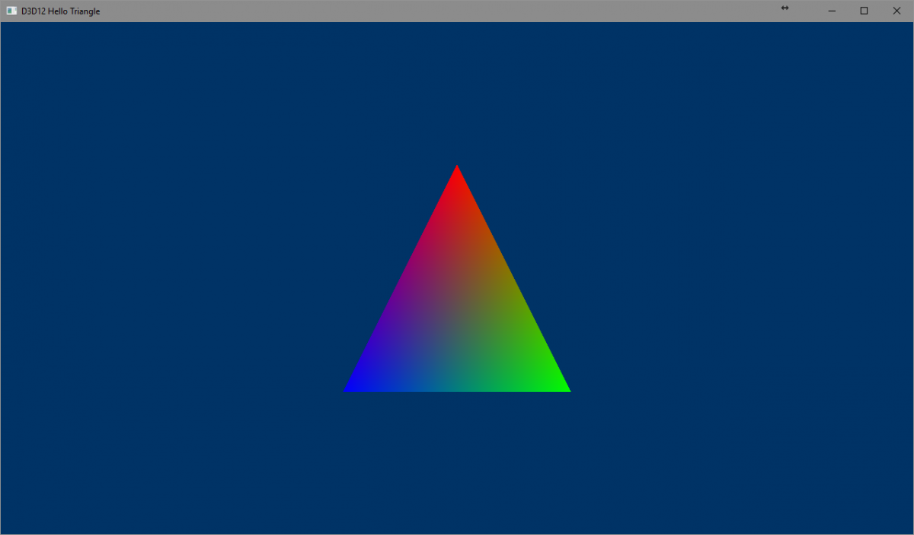

[TOC]

#DX12 Raytracing tutorial - Part 2

作者：[Martin-Karl Lefrançois](https://devblogs.nvidia.com/author/mlefrancois/) 和[Pascal Gautron](https://devblogs.nvidia.com/author/pgautron/)

译者：林公子

## 1 开始渲染
***
欢迎来到DXR光线追踪教程的第二部分。[第一部分](https://developer.nvidia.com/rtx/raytracing/dxr/DX12-Raytracing-tutorial-Part-1)向您展示了如何设置您的Windows 10编程环境以支持编写DXR光线追踪应用程序。现在，我们光线追踪添加到第一部分中使用的示例应用程序中。

## 2 着色管线
***
当用DirectX12创建光栅化着色器时，应用程序将其编译成可执行着色器，并与光栅化管道绑定。所有使用该流水线渲染的对象都将使用这些着色器。如果要用几种类型的着色器渲染图像，需要在调用绘制命令之前将光栅化管线设置为使用每种着色器。在光线追踪的背景下，追踪到场景的光线可以击中任何物体，从而触发任何着色器的执行。我们现在需要所有着色器既时可用(译注：因为从每个像素发射到场景中的射线求交是并行处理的，所以对Hit, Any Hit, Closest Hit这些着色器的调用针对不同的射线也是同时在进行的)，而不是一次只用一个可执行着色器。然后，管线包含渲染场景所需的所有着色器，以及如何执行它的信息。为了能够对一些几何体进行光线追踪，一个DXR管道通常至少要使用这3种HLSL着色器程序类型：
* 射线生成(ray generation)着色器，这将是光线追踪的起点，并为每个像素调用：它通常会初始化一个光线描述符RayDesc，从摄像机的位置开始，方向由评估像素位置的摄像机镜头模型给出。然后它将调用`TraceRay()`，将射线发射到场景中。下面的其他着色器将处理进一步的事件，并通过射线的payload将其结果返回给射线生成着色器。
* 当一条射线没有与任何几何体相交时，就会执行Miss着色器。它通常可以对环境贴图进行采样，或者通过射线的payload返回一个简单的颜色。
* `Closest Hit`着色器在击中最接近射线起点的几何实例时被调用。例如，这个着色器可以进行光照计算，并通过射线的payload返回结果。根据需要，可以有尽可能多的`Closest Hit`着色器，和基于光栅化的程序取决于不同的物体有多个着色器的思路相同。

还有两种着色器类型可以选择使用。

* `Intersection`着色器，它允许与用户定义的几何体相交。例如，当与程序化几何体或细分曲面相交时，这可能特别有用，而不用事先对它们进行镶嵌(tesselating)。它可以返回任意数量的值，最高可达`D3D12_RAYTRACING_MAX_ATTRIBUTE_SIZE_IN_BYTES`，在编写本教程时这个值为32。 使用这个着色器需要修改加速结构的构建方式，这已经超出了本教程的范围。我们将依靠DXR提供的内置三角形相交着色器，它返回一个由2个浮点值组成的结构，代表三角形内命中点的重心(barycentric)坐标（u,v）。对于一个由顶点v0、v1、v2组成的三角形，重心坐标定义顶点的权重如下：

>$Weight_v0$ = 1 - u - v
>$Weight_v1$ = u
>$Weight_v2$ = v

* `Any Hit`着色器在每个潜在的交点上执行：当搜索最接近射线原点的命中点时，可能会在中途发现几个候选点。Any Hit着色器通常可以用来有效地实现alpha测试。如果alpha测试失败，射线遍历可以继续，而不必再次调用`TraceRay()`。内置的`Any Hit`着色器只是一个传递通道，将交点返回给遍历引擎，该引擎将确定哪个潜在的交点是最接近的。

在本教程中，我们将创建一个只包含3个强制性着色器程序的管线：一个`RayGen`着色器()、一个`Miss`着色器和一个`Closest Hit`着色器。这是通过使用DirectX编译器`IDxcCompiler`将每个着色器程序编译成DirectX中间语言（DXIL）库，目标是`lib_6_3`。这个目标已经和DXR一起被引入。这样的库将在光线追踪管道中被连接在一起，它将能够把相交计算路由到正确的`Hit`着色器。为了能够专注于管线的生成，我们提供了简单的着色器：

<center></center>
<center><b>图1</b>：光线追踪管线</center>

>着色器([下载](https://developer.nvidia.com/rtx/raytracing/dxr/tutorial/Files/Shaders.zip))下载着色器并将其内容解压到主文件夹。

> 如果你要把着色器添加到解决方案中，需要把它们排除在编译之外，否则你会得到编译错误。

该档案包含4个文件：
* `Common.hlsl`被其他着色器所包含，它定义了光线payload结构体`HitInfo`，`HitInfo`被用来在着色器之间进行信息交流，它只包含一个float4向量，代表交点的颜色和从射线原点到该交点的距离。该文件还声明了`Attributes`结构体，该结构体将用于存储由相交着色器返回的`float2 barycentric`坐标。
* `RayGen.hlsl`包含了光线生成程序`RayGen()`，通过其语义`[shader("raygeneration")]`来标记。它还声明了对光线追踪输出缓冲区`gOutput`的访问，该缓冲区被绑定为无序访问视图（UAV），而光线追踪加速结构`SceneBVH`被绑定为着色器资源视图（SRV）。现在，这个着色器程序只是在光线追踪输出缓冲区中写入一个恒定的颜色。
* `Miss.hlsl`定义了`Miss()`着色器，其语义为`[shader("miss")]`。这个着色器将在没有几何体被击中时被执行，并将在payload中写入一个颜色常量。请注意，这个着色器将payload作为一个输出参数。它将由DXR自动提供给着色器。由于我们目前的光线生成程序暂时没有追踪任何光线，所以这个着色器将不会被调用。
* `Hit.hlsl`包含了一个非常简单的着色器`ClosestHit()`，其语义是`[shader("closesthit")]` 。它将在击中几何体（我们的三角形）时被执行。与`Miss`着色器一样，它将射线的payload作为一个输出参数。它还有第二个参数，定义了由相交着色器提供的相交属性，即重心坐标。这个着色器只是将一个颜色常量写入payload，以及由内置的`RayCurrentT()`函数提供的交点与射线原点的距离。

### 2.1 根签名和着色器库
***
着色器通常需要外部数据，如纹理、常量缓冲区等。这些输入在着色器代码中被指定，通过绑定数据到一个给定的寄存器。`RWTexture2D< float4 > gOutput : register(u0);`。在这种情况下，寄存器意味着数据可以在绑定到着色器的第一个无序访问视图（UAV，用字母u标识）中访问。常量缓冲区（CBV），可以用字母b来访问。 着色器资源（SRV）对应于字母t。使用简单的数字来识别所访问的缓冲区的索引，在寻址具有未知大小的缓冲区范围时可能会导致问题。当从几个来源组装着色器生成着色器变体(译注：shader permutations，也称为shader variants)时，这一点特别有用。HLSL引入了空间的概念，它允许重复使用相同的资源索引，同时避免冲突。
```hlsl
RWTexture2D< float4 > gOutput : register(u0, space0);
RWTexture2D< float4 > gEnvironment : register(u0, space1);
```

如果没有指定`space`，则使用`space0`。资源的绑定也是使用根签名明确定义的，它必须与着色器中定义的顺序和类型相匹配。该着色器中的每个绑定都对应于根签名中的一个条目。 一个根签名条目由一个`D3D12_ROOT_PARAMETER`结构体定义。每个条目都有一个类型，比如`D3D12_ROOT_PARAMETER_TYPE_CBV`用于直接访问一个常量缓冲区上的指针。这种直接访问也可用于UAV（`D3D12_ROOT_PARAMETER_TYPE_UAV`)和着色器资源(`D3D12_ROOT_PARAMETER_TYPE_SRV`)。一个条目也可以是一组直接指定的常量（`D3D12_ROOT_PARAMETER_TYPE_32BIT_CONSTANTS`），它对应于`register（b）`。最后，一个条目也可以指向当前绑定的描述符堆中的描述符(译注：原文这里是slot)的范围（`D3D12_ROOT_PARAMETER_TYPE_DESCRIPTOR_TABLE`）。

请注意，即使一个着色器不访问外部资源（例如返回一个硬编码的颜色），也需要定义一个根签名。在这种情况下，该签名将没有任何参数。因此，我们在头文件中添加了以下声明：创建根签名和管线本身的方法，包含着色器`DXIL`库的`IDxcBlob`的存储，着色器的根签名，以及管线对象本身`m_rtStateObject`。后者也将被转换为`ID3D12StateObjectProperties`，以访问它的一些功能，特别是使用其名称字符串查找着色器标识符的`ID3D12StateObjectProperties::GetShaderIdentifier()`方法。

```c++
// #DXR
ComPtr<id3d12rootsignature> CreateRayGenSignature();
ComPtr<id3d12rootsignature> CreateMissSignature();
ComPtr<id3d12rootsignature> CreateHitSignature();
void CreateRaytracingPipeline();
ComPtr<IDxcBlob> m_rayGenLibrary;
ComPtr<IDxcBlob> m_hitLibrary;
ComPtr<IDxcBlob> m_missLibrary;
ComPtr<ID3D12RootSignature> m_rayGenSignature;
ComPtr<ID3D12RootSignature> m_hitSignature;
ComPtr<ID3D12RootSignature> m_missSignature;

// Ray tracing pipeline state
ComPtr<ID3D12StateObject> m_rtStateObject;

// Ray tracing pipeline state properties, retaining the shader identifiers
// to use in the Shader Binding Table
ComPtr<ID3D12StateObjectProperties> m_rtStateObjectProps;
```

在`D3D12HelloTriangle.cpp`中添加以下内容，以访问用于生成光线追踪管线和根签名的辅助类。

```c++
#include "nv_helpers_dx12/RaytracingPipelineGenerator.h"
#include "nv_helpers_dx12/RootSignatureGenerator.h"
```

### 2.2 CreateRayGenSignature
***

RayGen程序的根签名表明该程序需要访问图像输出和包含顶层加速结构的缓冲区。 为了简单起见，本教程中介绍的根签名使用我们的RootSignatureGenerator[辅助类](https://developer.nvidia.com/rtx/raytracing/dxr/DX12-Raytracing-tutorial/dxr_tutorial_helpers)。`Add*`方法本质上是为每个条目创建`D3D12_ROOT_PARAMETER`描述符，而`Generate`调用则是将描述符合并为一个`D3D12_ROOT_SIGNATURE_DESC`，本身用于调用`D3D12SerializeRootSignature和ID3D12Device::CreateRootSignature`。

```c++
//-----------------------------------------------------------------------------
// The ray generation shader needs to access 2 resources: the raytracing output
// and the top-level acceleration structure
//
ComPtr<id3d12rootsignature> D3D12HelloTriangle::CreateRayGenSignature() 
{ 
    nv_helpers_dx12::RootSignatureGenerator rsc; rsc.AddHeapRangesParameter( 
    {{0 /*u0*/, 
      1 /*1 descriptor */, 
      0 /*use the implicit register space 0*/, 
      D3D12_DESCRIPTOR_RANGE_TYPE_UAV /* UAV representing the output buffer*/, 
      0 /*heap slot where the UAV is defined*/}, 
      {0 /*t0*/, 1, 0, D3D12_DESCRIPTOR_RANGE_TYPE_SRV /*Top-level acceleration structure*/, 1}});

      return rsc.Generate(m_device.Get(), true);
}
```

### 2.3 CreateHitSignature
***

起初，我们最`Closest Hit`程序将不需要任何外部数据。当射线将击中三角形时，我们将简单地在payload中返回一种颜色，如`Hit.hlsl`中所示。

```c++
//-----------------------------------------------------------------------------
// The hit shader communicates only through the ray payload, and therefore does
// not require any resources
//
ComPtr<id3d12rootsignature> D3D12HelloTriangle::CreateHitSignature() 
{ 
    nv_helpers_dx12::RootSignatureGenerator rsc; return rsc.Generate(m_device.Get(), true);
}
```

### 2.4 CreateMissSignature
***
`Miss`着色器的根签名也是空的，因为这个着色器只通过射线payload进行通信。

```c++
//-----------------------------------------------------------------------------
// The miss shader communicates only through the ray payload, and therefore
// does not require any resources
//
ComPtr<id3d12rootsignature> D3D12HelloTriangle::CreateMissSignature() 
{ 
    nv_helpers_dx12::RootSignatureGenerator rsc; return rsc.Generate(m_device.Get(), true);
}
```

### 2.5 CreateRaytracingPipeline
***

光线追踪管线将着色器代码、根签名和管线特性(pipeline characteristics)绑定在一个单一的结构体中，由DXR用来调用着色器并在光线追踪期间管理临时内存。 管线的设置需要创建和组合众多的DirectX 12子对象(subobject)，这是由DXR引入的概念。在本教程中，我们使用`RayTracingPipeline`[辅助类](https://developer.nvidia.com/rtx/raytracing/dxr/DX12-Raytracing-tutorial/dxr_tutorial_helpers)来简化代码，并在所创建的对象间强制一致性。在内部，每个`Add*`方法对应于一个或多个`D3D12_STATE_SUBOBJECT`添加到定义管线的此类子对象数组中。 我们通过为每个着色器生成`DXIL`库来开始这个方法。这个辅助函数首先打开指定的文件并加载其内容。如果有需要，它会初始化编译器，并通过调用`IDxcLibrary::CreateBlobWithEncodingFromPinned()`从文件内容中创建一个`IDxcBlobEncoding`结构体。然后，它通过调用`IDxcCompiler::Compile()`来编译数据，返回我们存储在该类中的`IDxcBlob`指针。

```c++
//-----------------------------------------------------------------------------
//
// The raytracing pipeline binds the shader code, root signatures and pipeline
// characteristics in a single structure used by DXR to invoke the shaders and
// manage temporary memory during raytracing
//
//
void D3D12HelloTriangle::CreateRaytracingPipeline()
{ 
    nv_helpers_dx12::RayTracingPipelineGenerator pipeline(m_device.Get()); 
    
    // The pipeline contains the DXIL code of all the shaders potentially executed 
    // during the raytracing process. This section compiles the HLSL code into a 
    // set of DXIL libraries. We chose to separate the code in several libraries 
    // by semantic (ray generation, hit, miss) for clarity. Any code layout can be 
    // used. 
    m_rayGenLibrary = nv_helpers_dx12::CompileShaderLibrary(L"RayGen.hlsl"); 
    m_missLibrary = nv_helpers_dx12::CompileShaderLibrary(L"Miss.hlsl"); 
    m_hitLibrary = nv_helpers_dx12::CompileShaderLibrary(L"Hit.hlsl");

    pipeline.AddLibrary(m_rayGenLibrary.Get(), { L"RayGen" });
	pipeline.AddLibrary(m_missLibrary.Get(), { L"Miss" });
	pipeline.AddLibrary(m_hitLibrary.Get(), { L"ClosestHit" });
}
```

一个`DXIL`库可以被看作是类似于一个普通的`DLL`，它包含可以使用一些导出的符号访问的编译代码。在光线追踪管线的情况下，这种符号对应于实现着色器程序的函数名称。对于每个文件，我们会在管线中添加库的指针，以及它所包含的函数的名称。注意，一个库可以输出任意数量的符号，而管道只允许导入其中的一个子集。

```c++
// As described at the beginning of this section, to each shader corresponds a
// root signature defining its external inputs.
// To be used, each DX12 shader needs a root signature defining which 
// parameters and buffers will be accessed. 
m_rayGenSignature = CreateRayGenSignature();
m_missSignature = CreateMissSignature();
m_hitSignature = CreateHitSignature();
```

射线与几何体交点的计算被分离成`Intersection`着色器、`Any Hit`着色器和`Closest Hit`着色器。这3个着色器被捆绑在一起，组成一个命中组(`HitGroup`)。在我们的例子中，使用了内置的`Intersection`和`Any Hit`着色器，所以我们的`HitGroup`只包含'Closest Hit'着色器'ClosestHit'。

```c++
pipeline.AddHitGroup(L"HitGroup", L"ClosestHit");   // HitGroup在Hit着色器中对应ClosestHit函数

// To be used, each shader needs to be associated to its root signature.
// A shaders imported from the DXIL libraries needs to be associated with 
// exactly one root signature.The shaders comprising the hit groups need 
// to share the same root signature, which is associated to the hit group
// (and not to the shaders themselves).Note that a shader does not have to 
// actually access all the resources declared in its root signature, as long 
// as the root signature defines a superset of the resources the shader needs.
// The following section associates the root signature to each shader. Note 
// that we can explicitly show that some shaders share the same root signature 
// (eg. Miss and ShadowMiss). Note that the hit shaders are now only referred 
// to as hit groups, meaning that the underlying intersection, any-hit and 
// closest-hit shaders share the same root signature. 
pipeline.AddRootSignatureAssociation(m_rayGenRootSignature.Get(), {L"RayGen"}); 
pipeline.AddRootSignatureAssociation(m_missRootSignature.Get(), {L"Miss"}); 
pipeline.AddRootSignatureAssociation(m_hitRootSignature.Get(), { L"HitGroup" });

// The payload size defines the maximum size of the data carried by the rays,
// ie. the the data
// exchanged between shaders, such as the HitInfo structure in the HLSL code.
// It is important to keep this value as low as possible as a too high value
// would result in unnecessary memory consumption and cache trashing.
pipeline.SetMaxPayloadSize(8 * sizeof(float)); // RGB + distance + normal

// Upon hitting a surface, DXR can provide several attributes to the hit. In
// our sample we just use the barycentric coordinates defined by the weights
// u,v of the last two vertices of the triangle. The actual barycentrics can
// be obtained using float3 barycentrics = float3(1.f-u-v, u, v);
pipeline.SetMaxAttributeSize(2 * sizeof(float)); // barycentric coordinates

// The ray tracing process can shoot rays from existing hit points, resulting
// in nested TraceRay calls. Our sample code traces only primary rays, which
// then requires a trace depth of 1. Note that this recursion depth should be
// kept to a minimum for best performance. Path tracing algorithms can be
// easily flattened into a simple loop in the ray generation.
pipeline.SetMaxRecursionDepth(1);
```

`Set*`方法设置与管线本身的全局属性相关的特定子对象。

* 着色器使用的最大payload大小，它定义了一个着色器可以与其他着色器交换的数据量。一个典型的例子是包含一个颜色值的payload，这样，`Hit`或`Miss`着色器可以将这个值返回给射线生成程序，后者将把这个值写入输出缓冲区。 为了达到最佳的性能，payload需要尽可能的小。在我们的例子中，payload包含4个浮点值，存储在`Common.hlsl`的`HitInfo`结构中，代表输出颜色和交点与射线原点的距离。
* 属性大小，由`Intersection`着色器设置。我们使用内置的三角形相交着色器，返回2个浮点值，对应于三角形交点的重心坐标。这些值可以使用`Common.hlsl`中的`Attributes`结构体来访问。
* 最大的递归深度，它描述了在追踪时可以进行多少次嵌套的(递归)`TraceRay()`调用。例如，一级递归可以用来从命中点发射阴影射线。但要注意的是，为了性能，这个递归层级须保持在尽可能低的水平。**因此，实现路径追踪器(Path Tracer)时不应该使用递归：而应该在射线生成程序中以循环方式实现多次反弹**。 在我们的案例中，将只调用`TraceRay()`一次，从相机中发射一条射线，而不再进行反弹，因此递归级别为1。
  
管线现在有了它需要的所有信息。我们通过调用[辅助类](https://developer.nvidia.com/rtx/raytracing/dxr/DX12-Raytracing-tutorial/dxr_tutorial_helpers)的`Generate`方法来生成管线，该方法创建了子对象的数组并调用`ID3D12Device5::CreateStateObject`。

```c++
m_rayTracingStateObject = pipeline.Generate();
ThrowIfFailed(m_rayTracingStateObject->QueryInterface(IID_PPV_ARGS(&m_rayTracingStateObjectProperties)));
```

### 2.6 OnInit()
***

在函数的末尾添加调用，以创建光线跟踪管线。
```c++
// Create the raytracing pipeline, associating the shader code to symbol names
// and to their root signatures, and defining the amount of memory carried by
// rays (ray payload)
CreateRaytracingPipeline(); // #DXR
```

>仔细检查程序的编译和运行。

## 3 创建资源
***

与光栅化不同，光线追踪过程并不直接写入渲染目标：相反，它将其结果写入一个作为无序访问视图（UAV）的缓冲区，然后再将其复制到渲染目标上进行显示。另外，任何调用`TraceRay()`的着色器程序都需要能够访问顶层加速结构（TLAS）。如[着色管线](https://developer.nvidia.com/rtx/raytracing/dxr/dx12-raytracing-tutorial-part-2#shadingpipeline)部分所示，射线生成着色器的根签名将对两个缓冲区的访问定义为资源堆中的两个范围。在这一节中，我们将首先创建光线追踪输出缓冲区`m_outputResource`，然后创建堆`m_srvUavHeap`，同时引用该缓冲区和`TLAS`。在D`3D12HelloTriangle.h`中添加以下声明：

```c++
// #DXR
void CreateRaytracingOutputBuffer();
void CreateShaderResourceHeap();
ComPtr<id3d12resource> m_outputResource;
ComPtr<id3d12descriptorheap> m_srvUavHeap;
```

### 3.1 CreateRaytracingOutputBuffer
***

下面的方法使用`ID3D12Device::CreateCommittedResource`分配了存放光线追踪输出的缓冲区，其大小与输出图像相同。这个缓冲区在复制源状态`D3D12_RESOURCE_STATE_COPY_SOURCE`中被初始化，这也是`PopulateCommandList`方法所假定的状态。该方法将把缓冲区过渡到`D3D12_RESOURCE_STATE_UNORDERED_ACCESS`，执行光线追踪，并过渡回`D3D12_RESOURCE_STATE_SOURCE`，以便使用`ID3D12GraphicsCommandList::CopyResource`将缓冲区的内容复制到渲染目标上。 那么重要的是，光线追踪输出缓冲区的创建要有`D3D12_RESOURCE_FLAG_ALLOW_UNORDERED_ACCESS`标志。

```c++
//-----------------------------------------------------------------------------
//
// Allocate the buffer holding the ray tracing output, with the same size as the
// output image
//
void D3D12HelloTriangle::CreateRaytracingOutputBuffer()
{
	D3D12_RESOURCE_DESC resDesc = {};
	resDesc.DepthOrArraySize = 1;
	resDesc.Dimension = D3D12_RESOURCE_DIMENSION_TEXTURE2D;

	// The backbuffer is actually DXGI_FORMAT_R8G8B8A8_UNORM_SRGB, but sRGB formats cannot be used
	// with UAVs. For accuracy we should convert to sRGB ourselves in the shader
	resDesc.Format = DXGI_FORMAT_R8G8B8A8_UNORM;

	resDesc.Flags = D3D12_RESOURCE_FLAG_ALLOW_UNORDERED_ACCESS;
	resDesc.Width = GetWidth();
	resDesc.Height = GetHeight();
	resDesc.Layout = D3D12_TEXTURE_LAYOUT_UNKNOWN;
	resDesc.MipLevels = 1;
	resDesc.SampleDesc.Count = 1;
	ThrowIfFailed(m_device->CreateCommittedResource(
		&nv_helpers_dx12::kDefaultHeapProps, D3D12_HEAP_FLAG_NONE, &resDesc,
		D3D12_RESOURCE_STATE_COPY_SOURCE, nullptr, IID_PPV_ARGS(&m_outputResource)));
}
```

### 3.2 CreateRaytracingOutputBuffer
***

所有着色器可访问的数据通常在渲染前以堆绑定的方式被引用。这个堆包含预定数量的槽(描述符)，每个槽都包含GPU内存中一个对象的视图。在实践中，堆是一个包含公共资源视图的内存区域。这样的视图可以通过`ID3D12Device::Create*View`的调用直接写入堆内存中。在本教程中，堆只包含两个条目：作为UAV访问的光线追踪输出缓冲区，以及顶层加速结构，它是一个着色器资源（SRV），有一个特定的尺寸标志`D3D12_SRV_DIMENSION_RAYTRACING_ACCELERATION_STRUCTURE`。

```c++
//-----------------------------------------------------------------------------
//
// Create the main heap used by the shaders, which will give access to the
// ray tracing output and the top-level acceleration structure
//
void D3D12HelloTriangle::CreateShaderResourceHeap()
{
	m_srvUavHeap = nv_helpers_dx12::CreateDescriptorHeap(m_device.Get(), 2, D3D12_DESCRIPTOR_HEAP_TYPE_CBV_SRV_UAV, true);

	D3D12_CPU_DESCRIPTOR_HANDLE srvHandle = m_srvUavHeap->GetCPUDescriptorHandleForHeapStart();

	D3D12_UNORDERED_ACCESS_VIEW_DESC uavDesc = {};
	uavDesc.ViewDimension = D3D12_UAV_DIMENSION_TEXTURE2D;
	m_device->CreateUnorderedAccessView(m_outputResource.Get(), nullptr, &uavDesc, srvHandle);

	srvHandle.ptr += m_device->GetDescriptorHandleIncrementSize(D3D12_DESCRIPTOR_HEAP_TYPE_CBV_SRV_UAV);

	D3D12_SHADER_RESOURCE_VIEW_DESC srvDesc;
	srvDesc.Format = DXGI_FORMAT_UNKNOWN;
	srvDesc.ViewDimension = D3D12_SRV_DIMENSION_RAYTRACING_ACCELERATION_STRUCTURE;
	srvDesc.Shader4ComponentMapping = D3D12_DEFAULT_SHADER_4_COMPONENT_MAPPING;
	srvDesc.RaytracingAccelerationStructure.Location = m_topLevelASBuffers.result->GetGPUVirtualAddress();
	
	m_device->CreateShaderResourceView(nullptr, &srvDesc, srvHandle);
}
```

### 3.3 OnInit()
***
在`OnInit`的最后添加创建光线追踪输出缓冲区和资源堆的内容。

```c++
// Allocate the buffer storing the raytracing output, with the same dimensions
// as the target image
CreateRaytracingOutputBuffer(); // #DXR

// Create the buffer containing the raytracing result (always output in a
// UAV), and create the heap referencing the resources used by the raytracing,
// such as the acceleration structure
CreateShaderResourceHeap(); // #DXR
```

## 4 着色器绑定表(Shader Binding Table)
***
着色器绑定表是所有程序和TLAS绑定在一起的地方，以知道执行哪个程序。 有一个`RayGen`, 至少有一个`Miss`，然后是`Hit`。`Hit`的条目应该有n个，最多到传递给实例描述参数`InstanceContributionToHitGroupIndex`的最大索引。在一个典型的光栅化设置中，在绘制相应的对象之前，要先绑定当前的着色器及其相关资源，然后可以为其他一些对象绑定另一个着色器和资源集，以此类推。由于光线追踪可以在任何时候击中场景的任何表面，所以不可能事先知道哪些着色器需要被绑定。因此，着色器绑定表（SBT）是一个SBT条目数组，保存着每个对象的着色器及其资源的位置信息。

### 4.1 SBT条目
***

一个SBT条目由头和数据部分组成。头部存储了着色器的标识符，而数据部分根据着色器的根签名中描述的布局，为着色器提供指针和原始数据。在`D3D12HelloTriangle.h`中添加以下`include`：

```c++
#include "nv_helpers_dx12/ShaderBindingTableGenerator.h"
```

这个文件包含了我们的SBT[辅助类](https://developer.nvidia.com/rtx/raytracing/dxr/DX12-Raytracing-tutorial/dxr_tutorial_helpers)，它简化了SBT的创建过程，并在SBT布局和后面的光线追踪调用之间实现了一致性。在内部，`Add*`方法收集了与GPU内存中输入资源的指针相关的着色器程序的名称。`Generate`调用映射输入缓冲区，对于每个收集的条目，使用`ID3D12StateObjectProperties::GetShaderIdentifier()`设置相应的着色器标识符，之后复制其资源指针。辅助类首先复制`RayGen`程序，然后`Miss`程序，最后是`HitGroup`。添加以下声明到`D3D12HelloTriangle.h`：

```c++
// #DXR
void CreateShaderBindingTable();
nv_helpers_dx12::ShaderBindingTableGenerator m_sbtHelper;
ComPtr<id3d12resource> m_sbtStorage;
```

### 4.2 CreateShaderBindingTable
***

着色器绑定表（SBT）是光线追踪设置的基石：它将几何体实例链接到其相应的命中组，并根据其根签名将资源绑定到光线追踪着色器程序上。 在本教程中，我们有一个包含单一实例的场景。然后，着色器绑定表将有3个条目：一个用于RayGen`程序，一个用于`Miss`程序，还有一个用于命中组。光线生成需要访问两个外部资源：光线追踪输出缓冲区和顶层加速结构。 射线生成着色器的根签名要求这两种资源在当前绑定的堆中都是可用的。因此，着色器只需要有一个指向堆开始的指针。命中组和`Miss`程序不使用任何外部数据，因此有一个空的根签名。然后，SBT的布局如下：

|SBT       |          |
|:----     |:----     |
|RayGen    |Identifier|
|Heap Start|Pointer   |
|Miss      |Identifier|
|HitGrop   |Identifier|

在启动光线追踪过程时，光线生成程序的标识符(`identifier`)将被用来执行其每个像素的入口点(`Hit.hlsl`中的`Hit()`, `ClosestHit()`等)。指向堆的指针将使着色器找到所需的资源。 当射线生成程序射出一条射线时，堆指针将被用来寻找GPU内存中顶层加速结构的位置，并触发追踪本身。射线可能会错过所有的几何体，在这种情况下，SBT将被用来寻找`Miss`着色器标识符并执行相应的代码。如果射线命中了几何体，命中组的标识符将被用来寻找与命中组相关的着色器：`Intersection`、`Any Hit`和`Closest Hit`。这些着色器将按顺序被执行，并将结果发送给光线生成着色器。然后，光线生成着色器可以从堆中访问光线追踪输出缓冲区，并写入其结果。如果场景包含几个对象，有不同的命中组，SBT将包含所有的命中组和它们的资源。举个例子，我们可以有3个对象，每个对象都在主堆中访问一些摄像机数据。对象0和1会有各自的纹理，而对象2则没有。那么SBT将有这样的结构：

|SBT       |          |
|:----     |:----     |
|RayGen    |Identifier|
|Heap Start|Pointer   |
|Miss      |Identifier|
|HitGrop0  |Identifier|
|Heap Start|Pointer   |
|HitGrop1  |Identifier|
|Heap Start|Pointer   |
|Texture1  |Pointer   |
|HitGrop2  |Identifier|
|Heap Start|Pointer   |

请注意，HitGroup2并不访问任何纹理。然而，SBT的对齐要求迫使每个程序类型(`RayGen`、`Miss`、`HitGroup`)的所有成员都要有一个固定的入口大小。然后，一个给定的程序类型的条目大小由该类型中最大的根签名的大小驱动：`RayGen`的大小是1，'Miss`的大小是0，`HitGroup`的大小是2。因此，SBT条目被填充以满足对齐要求。在很多情况下，光线追踪过程会使用多种光线类型，例如区分常规光线和阴影光线。在这种情况下，对于每个对象类型，SBT将为每个射线类型包含一个`HitGroup`。为了简洁起见，回到一个只有一个对象的示例，添加第二个射线类型只需要在SBT中添加相应的`HitGroup`：

|SBT          |          |
|:----        |:----     |
|RayGen       |Identifier|
|Heap Start   |Pointer   |
|Miss         |Identifier|
|HitGrop      |Identifier|
|ShadowGrop   |Identifier|

管线如何将一个几何体与一个命中组联系起来，取决于向顶层AS辅助类添加实例时使用的命中组索引(对应代码中`m_topLevelASGenerator.AddInstance()`函数的第4个参数`hitGroupIndex`)。在内部，这个索引映射到`D3D12_RAYTRACING_INSTANCE_DESC`描述符的`InstanceContributionToHitGroupIndex`。回到我们的例子，射线生成只需要访问堆指针，而其他程序没有任何资源需要访问。我们首先重置了SBT，因为预计到了潜在的动态更新。然后我们使用`GetGPUDescriptorHandleForHeapStart`获取存储堆描述符在GPU内存上的句柄：

```c++
//-----------------------------------------------------------------------------
//
// The Shader Binding Table (SBT) is the cornerstone of the raytracing setup:
// this is where the shader resources are bound to the shaders, in a way that
// can be interpreted by the raytracer on GPU. In terms of layout, the SBT
// contains a series of shader IDs with their resource pointers. The SBT
// contains the ray generation shader, the miss shaders, then the hit groups.
// Using the helper class, those can be specified in arbitrary order.
//
void D3D12HelloTriangle::CreateShaderBindingTable() 
{ 
    // The SBT helper class collects calls to Add*Program. If called several 
    // times, the helper must be emptied before re-adding shaders. 
    m_sbtHelper.Reset(); 
    
    // The pointer to the beginning of the heap is the only parameter required by 
    // shaders without root parameters 
    D3D12_GPU_DESCRIPTOR_HANDLE srvUavHeapHandle = m_srvUavHeap->GetGPUDescriptorHandleForHeapStart();
    
    auto heapPointer = reinterpret_cast<uint64_t*>(srvUavHeapHandle.ptr);

    m_sbtHelper.AddRayGenerationProgram(L"RayGen", { heapPointer });
    m_sbtHelper.AddMissProgram(L"Miss", {});
    m_sbtHelper.AddHitGroup(L"HitGroup", {});

    const uint32_t sbtSize = m_sbtHelper.ComputeSBTSize();
    m_sbtStorage = nv_helpers_dx12::CreateBuffer(m_device.Get(), sbtSize, D3D12_RESOURCE_FLAG_NONE, D3D12_RESOURCE_STATE_GENERIC_READ, nv_helpers_dx12::kUploadHeapProps);
    if (!m_sbtStorage)
    {
    	throw std::logic_error("Could not allocate the shader binding table");
    }

    m_sbtHelper.Generate(m_sbtStorage.Get(), m_rtStateObjectProps.Get());
```

堆内存上的GPU句柄的`ptr`成员是`UINT64`类型，尽管它代表一个指针。由于辅助类只接受指针来定义着色器资源，我们需要将64位的整数转换为64位的指针。我们现在可以添加例子中使用的各种程序：根据其根签名，光线生成着色器需要访问射线追踪输出缓冲区和堆中引用的顶层加速结构。因此，它需要一个单一的资源指针指向堆数据的开头。`Miss`着色器和`HitGroup`只通过射线payload进行通信，不需要任何资源，因此是一个空的资源数组。请注意，辅助类将按SBT中的类型对着色器进行分组，因此可以按任意顺序声明它们。例如，可以在`RayGen`程序之前或之后添加`Miss`程序而不影响结果。

然而，在一个特定的类型中(例如，`HitGroup`)，它们被添加的顺序是很重要的。它需要与将实例添加到顶层加速结构时使用的`InstanceContributionToHitGroupIndex`值相对应：例如，一个实例`InstanceContributionToHitGroupIndex == 0`需要在SBT中首先添加它的`HitGroup`。

从程序和命中组的数量以及它们各自的参数数量，帮助器可以计算出所产生的SBT的大小。对于每个着色器类型，该方法只是计算该类型着色器的最大参数数。从这一点，以及着色器标识符的大小，可以得到最终的SBT大小。然后我们在上传堆上分配SBT。这很重要，因为SBT的生成是通过缓冲区映射完成的。

### 4.3 OnInit()
***
添加以下一行来调用创建SBT。

```c++
// Create the shader binding table and indicating which shaders
// are invoked for each instance in the AS
CreateShaderBindingTable();
```

## 5 调用光线追踪器
***

在这一步中，我们将启动光线追踪过程，并将生成的输出缓冲区复制到渲染目标中。在这一点上，我们仍然使用所提供的光线生成程序，它并没有调用任何光线追踪。相反，它只是在所有像素中设置一个橙色。

### 5.1 PopulateCommandList()
***

找到光线追踪的`if-else`语句，用对光线追踪的调用来代替清除缓冲区。这一部分的主要内容是设置光线追踪描述符`D3D12_DISPATCH_RAYS_DESC`，它定义了如何解释SBT，以及需要渲染多少个像素（即有多少个线程会同时运行光线生成程序）。射线追踪实际上是通过调用`ID3D12GraphicsCommandList4::DispatchRays()`进行的。我们首先将当前堆设置为`m_srvUavHeap`，这样光线追踪的输出缓冲区和顶层加速结构就可以从着色器中访问。

```c++
// #DXR
// Bind the descriptor heap giving access to the top-level acceleration
// structure, as well as the raytracing output
std::vector<id3d12descriptorheap*> heaps = {m_srvUavHeap.Get()};
m_commandList->SetDescriptorHeaps(static_cast<uint>(heaps.size()), heaps.data());
```

如前所述，光线追踪与光栅化不同，不能直接渲染到渲染目标中。相反，我们需要使`CD3DX12_RESOURCE_BARRIER::Transition`对象将光线追踪输出的内容复制到渲染目标中。当进入`PopulateCommandList`方法时，光线追踪输出缓冲区处于`D3D12_RESOURCE_STATE_SOURCE`状态。为了让光线生成着色器以`UAV`的形式写入缓冲区，我们将缓冲区过渡到`D3D12_RESOURCE_STATE_UNORDERED_ACCESS`状态。

```c++
// On the last frame, the raytracing output was used as a copy source, to
// copy its contents into the render target. Now we need to transition it to
// a UAV so that the shaders can write in it.
CD3DX12_RESOURCE_BARRIER transition = CD3DX12_RESOURCE_BARRIER::Transition(
    m_outputResource.Get(), 
    D3D12_RESOURCE_STATE_COPY_SOURCE,
    D3D12_RESOURCE_STATE_UNORDERED_ACCESS);
    m_commandList->ResourceBarrier(1, &transition);
```

`D3D12_DISPATCH_RAYS_DESC`描述符指定了在光线追踪过程中要做的工作：具体来说，它包含着色器绑定表（SBT）中的入口点，以及要渲染的图像的大小。 使用辅助类，SBT总是首先包含`RayGen`着色器，然后是`Miss`着色器，最后是`HitGroup`。包含`RayGen`着色器的SBT部分的起始地址就是SBT缓冲区的开始。 SBT中的每`RayGen`条目都有相同的尺寸，这也是从辅助类`GetRayGenSectionSize`函数调用中获得的。这就加强了SBT和光线追踪之间的一致性，这是一个常见的错误来源。注意，只允许有一个`RayGen`着色器，因为这是光线追踪过程的入口。如果SBT中存在多个`RayGen`着色器，我们将需要相应地偏移`RayGen`着色器记录的`StartAddress`。

```c++
// Setup the ray tracing task
D3D12_DISPATCH_RAYS_DESC desc = {};

// The layout of the SBT is as follows: ray generation shader, miss
// shaders, hit groups. As described in the CreateShaderBindingTable method,
// all SBT entries of a given type have the same size to allow a fixed stride.
// The ray generation shaders are always at the beginning of the SBT.
uint32_t rayGenerationSectionSizeInBytes = m_sbtHelper.GetRayGenSectionSize();
desc.RayGenerationShaderRecord.StartAddress = m_sbtStorage->GetGPUVirtualAddress();
desc.RayGenerationShaderRecord.SizeInBytes = rayGenerationSectionSizeInBytes;
```

`Miss`着色器紧跟在`RayGen`着色器之后，因此`Miss`着色器的开始是通过将SBT缓冲区指针偏移`RayGen`部分的大小来获得的。`StrideInBytes`允许光线追踪使用多个`Miss`程序，每个程序与一个光线类型相关。例如，这允许有主射线，对于主射线，`Miss`着色器会返回环境颜色，而对于阴影射线，`Miss`着色器会返回一个可见性值(visibility)。

```c++
// The miss shaders are in the second SBT section, right after the ray
// generation shader. We have one miss shader for the camera rays and one
// for the shadow rays, so this section has a size of 2*m_sbtEntrySize. We
// also indicate the stride between the two miss shaders, which is the size
// of a SBT entry
uint32_t missSectionSizeInBytes = m_sbtHelper.GetMissSectionSize();
desc.MissShaderTable.StartAddress = m_sbtStorage->GetGPUVirtualAddress() + rayGenerationSectionSizeInBytes;
desc.MissShaderTable.SizeInBytes = missSectionSizeInBytes;
desc.MissShaderTable.StrideInBytes = m_sbtHelper.GetMissEntrySize();
```

命中组的定义与`Miss`着色器类似。在实践中，SBT会包含很多命中组，就像一个基于光栅化的渲染器会有很多像素着色器一样。当使用多个光线类型时，所产生的命中组应该被打包在一起，正如 "[更进一步](https://developer.nvidia.com/rtx/raytracing/dxr/dx12-raytracing-tutorial-part-2#goingfurther)"部分中的阴影示例所示。

```c++
// The hit groups section start after the miss shaders. In this sample we
// have one 1 hit group for the triangle
uint32_t hitGroupsSectionSize = m_sbtHelper.GetHitGroupSectionSize();
desc.HitGroupTable.StartAddress = m_sbtStorage->GetGPUVirtualAddress() + rayGenerationSectionSizeInBytes + missSectionSizeInBytes;
desc.HitGroupTable.SizeInBytes = hitGroupsSectionSize;
desc.HitGroupTable.StrideInBytes = m_sbtHelper.GetHitGroupEntrySize();
```

光线追踪描述符还包含要渲染的图像的大小，它定义了同时运行光线生成程序的线程数量。

```c++
// Dimensions of the image to render, identical to a kernel launch dimension
desc.Width = GetWidth();
desc.Height = GetHeight();
desc.Depth = 1;
```

然后我们在命令列表中绑定光线追踪管线。`DispatchRays`是实际将光线追踪工作入队命令列表的调用。

```c++
// Bind the raytracing pipeline
m_commandList->SetPipelineState1(m_rtStateObject.Get());

// Dispatch the rays and write to the raytracing output
m_commandList->DispatchRays(&desc);
```

一旦生成了光线追踪图像，它仍然需要被复制到渲染目标中，以便能够被显示。为此，我们首先将光线追踪输出`m_outputResource`从允许着色器写入的`D3D12_RESOURCE_STATE_UNORDERED_ACCESS`状态过渡到`D3D12_RESOURCE_STATE_SOURCE`状态。此时，渲染目标处于`D3D12_RESOURCE_STATE_RENDER_TARGET`状态，这允许它在屏幕上呈现。因此，我们需要将它过渡到`D3D12_RESOURCE_STATE_COPY_DEST`，以便将光线追踪输出的内容复制给它。复制本身是由`ID3D12GraphicsCommandList::CopyResource`执行的。一旦复制完成，渲染目标就会过渡到`D3D12_RESOURCE_STATE_RENDER_TARGET`状态进行显示。

```c++
// The raytracing output needs to be copied to the actual render target used
// for display. For this, we need to transition the raytracing output from a
// UAV to a copy source, and the render target buffer to a copy destination.
// We can then do the actual copy, before transitioning the render target
// buffer into a render target, that will be then used to display the image
transition = CD3DX12_RESOURCE_BARRIER::Transition( 
    m_outputResource.Get(), 
    D3D12_RESOURCE_STATE_UNORDERED_ACCESS,
    D3D12_RESOURCE_STATE_COPY_SOURCE);

m_commandList->ResourceBarrier(1, &transition);

transition = CD3DX12_RESOURCE_BARRIER::Transition( 
    m_renderTargets[m_frameIndex].Get(), 
    D3D12_RESOURCE_STATE_RENDER_TARGET,
    D3D12_RESOURCE_STATE_COPY_DEST);

m_commandList->ResourceBarrier(1, &transition);

m_commandList->CopyResource(m_renderTargets[m_frameIndex].Get(), m_outputResource.Get());

transition = CD3DX12_RESOURCE_BARRIER::Transition(
    m_renderTargets[m_frameIndex].Get(), 
    D3D12_RESOURCE_STATE_COPY_DEST, 
    D3D12_RESOURCE_STATE_RENDER_TARGET);

m_commandList->ResourceBarrier(1, &transition);
```

现在，光线追踪的基础已经到位：光线追踪管线已经完全设置好了，`DispatchRays`为图像的每个像素调用了光线生成着色器。由于该光线生成着色器只向光线追踪输出缓冲区写入纯色，结果应该是这样的：

|  Raster   | Compare          | Raytracing                          |
|:----:     |:----:            |:----:                               |
|   |↔|  |
<center><b>图2</b>：使用空格键在光栅化和光线追踪之间交替进行</center>

>打开`RayGen.hlsl`，改变返回值。

## 6 简单的RayGen和Hit着色器
***

到目前为止，当我们在调用`DispatchRays()`时，射线生成着色器`RayGen()`被调用，但没有射线被创建。我们将通过添加一个正交视图来改变这种情况，然后改变`Hit`着色器，使其看起来像光栅化的三角形。

### 6.1 RayGen
***

我们将修改着色器文件`RayGen.hlsl`中`RayGen()`函数的`HLSL`代码，以便使用与默认光栅化相同的正交相机对每个像素进行光线追踪。我们首先初始化光线payload，它将被用来收集光线追踪的结果。内置的`DispatchRaysIndex()`提供了当前像素的2D坐标，而`DispatchRaysDimensions()`则返回正在渲染的图像的大小。由此，我们可以推导出浮点像素坐标d，在[0,1] * [0,1]上归一化。

```hlsl
// Initialize the ray payload
HitInfo payload;
payload.colorAndDistance = float4(0, 0, 0, 0);

// Get the location within the dispatched 2D grid of work items
// (often maps to pixels, so this could represent a pixel coordinate).
uint2 launchIndex = DispatchRaysIndex().xy;
float2 dims = float2(DispatchRaysDimensions().xy);
float2 d = (((launchIndex.xy + 0.5f) / dims.xy) * 2.f - 1.f);
```

已知默认摄像机位于`(0, 0, 1)`并朝`(0, 0, -1)`方向看，我们可以设置一个射线描述符`RayDesc`，通过将射线原点的`x`和`y`坐标偏移为归一化的浮点像素坐标，代表一条穿过每个像素的射线。注意，`y`坐标是倒置的，以符合DirectX的图像索引惯例。最小命中距离`TMin`相当于光栅化世界中的相机近剪裁平面，尽管对于光线追踪来说，0的值也是有效的。`TMax`的值相当于远处的剪裁平面。请注意，与光栅化不同的是，`TMin`和`TMax`之间的比例对相交计算的精度没有任何影响。

```hlsl
// Define a ray, consisting of origin, direction, and the min-max distance values
RayDesc ray;
ray.Origin = float3(d.x, -d.y, 1);
ray.Direction = float3(0, 0, -1);
ray.TMin = 0;
ray.TMax = 100000;
```

然后使用`TraceRay`调用对射线进行追踪：它将遍历加速结构，并根据遍历的结果调用命中组或`Miss`着色器。射线标志被保留为默认的`RAY_FLAG_NONE`，但它们可以被用来优化击中表面时的行为，例如绕过任何`Hit`着色器的调用(`RAY_FLAG_FORCE_OPAQUE`)。 `InstanceInclusionMask`掩码可以通过在该掩码和实例的掩码之间做一个按位与(`AND`)操作来将一些几何体从光线追踪中排除。标记默认为`0xFF`，因此将光线标记设置为`0xFF`，就不会有几何体被屏蔽。接下来的两个参数展示了DXR在寻找对应于给定几何体实例的命中组时提供的灵活性。请注意，为顶层加速结构和着色器绑定表提供的帮助器只提供了功能性的一个子集。`RayContributionToHitGroupIndex`取决于射线的类型。当使用多种射线类型时，一个给定的对象可以有几个附加的命中组（即命中计算常规阴影时要做什么，命中计算阴影时要做什么）。这些命中组是按顺序在SBT中指定的，所以该参数的值表示对该射线的命中组应用哪个偏移量（4位）。在这个例子中，我们每个物体只有一个命中组，因此偏移量为0。`MultiplierForGeometryContributionToHitGroupIndex`表示如何根据实例索引计算SBT中命中组的索引。 SBT中的偏移量可以通过对象ID、实例ID来计算，但也可以简单地通过对象在加速结构中的添加顺序来计算。这允许应用程序在SBT中按照在AS中添加的相同顺序对着色器进行分组，在这种情况下，下面的值代表两个连续对象之间的跨度（4位代表命中组的数量）。最后，射线描述符和payload也被传递给`TraceRay`以驱动遍历，并在命中组和`Miss`着色器之间携带数据。

```hlsl
// Trace the ray
TraceRay( 
    // Parameter name: AccelerationStructure 
    // Acceleration structure SceneBVH, 
    // Parameter name: RayFlags 
    // Flags can be used to specify the behavior upon hitting a surface 
    RAY_FLAG_NONE, 
    // Parameter name: InstanceInclusionMask 
    // Instance inclusion mask, which can be used to mask out some geometry to this ray by 
    // and-ing the mask with a geometry mask. The 0xFF flag then indicates no geometry will be 
    // masked 
    0xFF, 
    // Parameter name: RayContributionToHitGroupIndex 
    // Depending on the type of ray, a given object can have several hit groups attached 
    // (ie. what to do when hitting to compute regular shading, and what to do when hitting 
    // to compute shadows). Those hit groups are specified sequentially in the SBT, so the value 
    // below indicates which offset (on 4 bits) to apply to the hit groups for this ray. In this 
    // sample we only have one hit group per object, hence an offset of 0. 
    0, 
    // Parameter name: MultiplierForGeometryContributionToHitGroupIndex 
    // The offsets in the SBT can be computed from the object ID, its instance ID, but also simply 
    // by the order the objects have been pushed in the acceleration structure. This allows the
    // application to group shaders in the SBT in the same order as they are added in the AS, in 
    // which case the value below represents the stride (4 bits representing the number of hit 
    // groups) between two consecutive objects. 
    0, 
    // Parameter name: MissShaderIndex 
    // Index of the miss shader to use in case several consecutive miss shaders are present in the 
    // SBT. This allows to change the behavior of the program when no geometry have been hit, for 
    // example one to return a sky color for regular rendering, and another returning a full 
    // visibility value for shadow rays. This sample has only one miss shader, hence an index 0 
    0, 
    // Parameter name: Ray 
    // Ray information to trace 
    ray, 
    // Parameter name: Payload 
    // Payload associated to the ray, which will be used to communicate between the hit/miss 
    // shaders and the raygen 
    payload);
```

`TraceRay`是阻塞式的，本质上类似于纹理查询，在调用纹理采样器之后，结果就可以得到。因此，在`TraceRay`之后，该像素的整个光线追踪已经完成，payload代表了光线追踪过程中可能调用的各种着色器的执行结果。然后我们可以读取payload并将其写入输出缓冲区。

```hlsl
gOutput[launchIndex] = float4(payload.colorAndDistance.rgb, 1.f);
```

`Closest Hit`和`Miss`着色器仍然是返回纯色最原始的那个。

<center></center>
<center><b>图3</b>：黄色：Hit着色器，蓝色：Miss着色器</center>

### 6.2 Hit着色器
***

我们也可以改变`Hit.hlsl`的`ClosestHit()`函数，以类似于光栅化器的方式在整个三角形内插值颜色。要做到这一点，我们采用内置三角形相交着色器提供的重心坐标属性`attrib`，并使用这些属性在硬编码的颜色值之间进行插值。然后我们写入payload，这将使这些值在之后的光线生成着色器中可用。

<center></center>
<center><b>图4</b>：使用重心坐标进行颜色插值</center>
<br>

>实验：你可以修改`Miss`着色器中的数值，看看背景的变化。如果你修改`Hit`着色器中的代码，可以改变三角形的渲染方式。

## 7 使用顶点缓冲
***

我们的`Hit`着色器中的颜色是硬编码的，为了保证光栅化和光线追踪之间的一致性，最好是使用存储在顶点缓冲器中的颜色信息。在大多数实际的光线追踪实现中，都需要访问顶点缓冲区的信息，不仅是为了顶点颜色，而且还为了查询和插值纹理坐标或法线。

### 7.1 CreateHitSignature
***
命中组原本不需要任何外部输入，因为它只是处理相交属性并在payload中返回一个颜色。为了访问顶点缓冲区，我们需要告诉`Hit`根签名，我们将使用一个着色器资源视图（SRV）。默认情况下，它将被绑定到着色器中的`register(t0)`。在`CreateHitSignature()`中添加以下一行：

```c++
rsc.AddRootParameter(D3D12_ROOT_PARAMETER_TYPE_SRV);
```

## 8 CreateShaderBindingTable
***
在SBT中，我们现在必须将这个缓冲区在GPU内存中的地址传递给`Hit`着色器，这是由根签名指定的。在`CreateShaderBindingTable()`中，将`AddHitGroup`的调用替换为：

```c++
m_sbtHelper.AddHitGroup(L"HitGroup", {(void*)(m_vertexBuffer->GetGPUVirtualAddress())});
```

## 9 Hit.hlsl
***
最后的修改是修改`Hit`着色器以获得对数据的访问。我们通过定义`STriVertex`来复制`HLSL`代码中顶点的数据结构，它与CPU端定义的顶点结构具有相同的位映射。然后我们引用一个映射到`register(t0)`的`StructuredBuffer`。

```hlsl
struct STriVertex
{ 
    float3 vertex; float4 color;
};

StructuredBuffer<strivertex> BTriVertex : register(t0);
```

在着色器的`ClosestHit`函数中，我们可以使用内置的`PrimitiveIndex()`调用来获得我们击中的三角形的索引。移除之前的命中颜色计算，用这个代替，以访问顶点数据。

```hlsl
uint vertId = 3 * PrimitiveIndex();
float3 hitColor = BTriVertex[vertId + 0].color * barycentrics.x + 
                  BTriVertex[vertId + 1].color * barycentrics.y + 
                  BTriVertex[vertId + 2].color * barycentrics.z;
```

### 9.1 LoadAssets()
***
你可以通过修改`LoadAssets()`中顶点缓冲区的创建来验证顶点缓冲区的访问是否正常。例如，通过将其改为以下内容，光栅化和光线追踪中的颜色都会发生变化。

```c++
Vertex triangleVertices[] = { 
    {{0.0f, 0.25f * m_aspectRatio, 0.0f}, {1.0f, 1.0f, 0.0f, 1.0f}}, 
    {{0.25f, -0.25f * m_aspectRatio, 0.0f}, {0.0f, 1.0f, 1.0f, 1.0f}}, 
    {{-0.25f, -0.25f * m_aspectRatio, 0.0f}, {1.0f, 0.0f, 1.0f, 1.0f}}};
```

|  Raster   | Compare          | Raytracing                          |
|:----:     |:----:            |:----:                               |
|   |↔|  |
<center><b>图4</b>：按空格键之后</center>

最终版本([下载](https://developer.nvidia.com/rtx/raytracing/dxr/tutorial/Files/dxr_tutorial.zip))你可以抓取教程的最终版本。

## 10 更进一步
***
恭喜你，你现在可以使用DXR对一个三角形进行光线追踪了。在此基础上我们实现更高级的效果。

* [Per Instance Data](https://developer.nvidia.com/rtx/raytracing/dxr/DX12-Raytracing-tutorial/Extra/dxr_tutorial_extra_per_instance_data)：通过实例化在场景中添加更多的几何体，并使用常量来被`Hit`程序使用，以引入一些每个实例的变化。

* [Perspective Camera](https://developer.nvidia.com/rtx/raytracing/dxr/DX12-Raytracing-tutorial/Extra/dxr_tutorial_extra_perspective)：增加透视摄像机，以提供更好的光栅化和光线追踪的视图。

* [Depth Buffer](https://developer.nvidia.com/rtx/raytracing/dxr/DX12-Raytracing-tutorial/Extra/dxr_tutorial_extra_depth_buffer)：设置一个深度缓冲区，以确保在栅格化中只有最接近的表面是可见的。

* [Indexed Geometry](https://developer.nvidia.com/rtx/raytracing/dxr/DX12-Raytracing-tutorial/Extra/dxr_tutorial_extra_indexed_geometry)：添加一些更复杂的几何体，使用索引的顶点缓冲器。几何图形本身是Menger Sponge分形的一个随机变化。

* [Shadows](https://developer.nvidia.com/rtx/raytracing/dxr/DX12-Raytracing-tutorial/Extra/dxr_tutorial_extra_another_ray_type)：添加一个辅助射线类型，用于追踪来自命中点阴影的阴影射线。

* [Animation](https://developer.nvidia.com/rtx/raytracing/dxr/DX12-Raytracing-tutorial/Extra/dxr_tutorial_extra_refit)：通过改造顶层加速结构来实现场景的动画化。

教程补充([下载](https://developer.nvidia.com/rtx/raytracing/dxr/tutorial/Files/DXRTutorial_Extra.zip))这是一个修改后的教程，包含上述所有内容的例子，包括一些来自[imgui](https://github.com/ocornut/imgui)的GUI。

<center></center>

## 11 甚至更远!
***
上面的额外内容让我们了解了在简单应用中探索光线追踪所需的主要部分。在这个基础上，我们可以开始添加更多的功能。

* [Simple Lighting](https://developer.nvidia.com/rtx/raytracing/dxr/DX12-Raytracing-tutorial/Extra/dxr_tutorial_extra2_simple_lighting)： 计算法线并添加来自点光源的漫反射阴影。

## 12 参考文献
***
https://github.com/Microsoft/DirectX-Graphics-Samples/tree/master/Samples/Desktop/D3D12Raytracing
https://github.com/NVIDIAGameWorks/Falcor/tree/master/Samples/Raytracing/HelloDXR
https://github.com/nvidiagameworks/dxrtutorials

如果你有关于本教程的问题，请访问我们的[开发者论坛](https://devtalk.nvidia.com/default/board/70/directx-and-direct-compute/)。